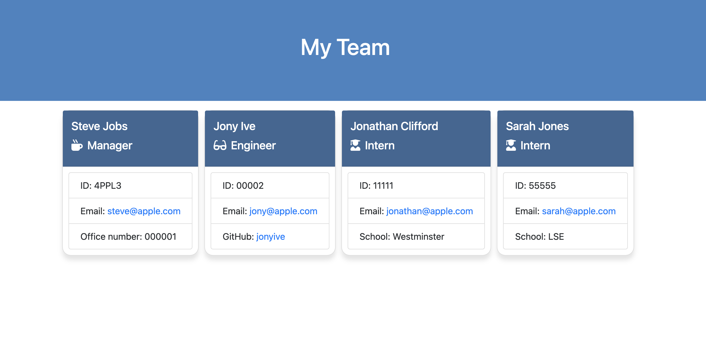

# Module 12 Challenge: Team Profile Generator

## Description

This is a Node.js command-line application designed to generate a webpage that displays summaries for each member of a software engineering team. It collects information about team members from the user and generates an HTML file containing the team's basic information, such as names, roles, employee IDs, email addresses, GitHub usernames (for engineers), and schools (for interns).

## Tasks completed

* When 'node index.js' is run in terminal the application will display prompts to fill in the sections for team members.

* Once all team members are added and the application is closed, it will generate a 'team.html' featuring the team members added with their info displayed.

* Some additonal styling added to website.

## Features

* Interactive command-line interface (CLI) powered by Inquirer.js.
* Classes for different team member types (Manager, Engineer, Intern) with methods to get and set information.
* Validation to ensure proper formatting of user input.
* Unit tests using Jest to verify the functionality of each class.
* Automatic generation of an HTML file based on user input.

## Technologies Used

* Node.js
* Inquirer.js
* Jest

## Links

[Link to the code repository](https://github.com/jonnoclifford/Team-Profile-Generator)

## Usage

* Type 'node index.js' into the terminal and fill in requested information.
* Open generated team.html to view team.

## Demo

## Credits

Supported by Edx teaching staff and particularly Juan Delgado.

## License

MIT License

Copyright (c) 2024 Jonathan Clifford

Permission is hereby granted, free of charge, to any person obtaining a copy
of this software and associated documentation files (the "Software"), to deal
in the Software without restriction, including without limitation the rights
to use, copy, modify, merge, publish, distribute, sublicense, and/or sell
copies of the Software, and to permit persons to whom the Software is
furnished to do so, subject to the following conditions:

The above copyright notice and this permission notice shall be included in all
copies or substantial portions of the Software.

THE SOFTWARE IS PROVIDED "AS IS", WITHOUT WARRANTY OF ANY KIND, EXPRESS OR
IMPLIED, INCLUDING BUT NOT LIMITED TO THE WARRANTIES OF MERCHANTABILITY,
FITNESS FOR A PARTICULAR PURPOSE AND NONINFRINGEMENT. IN NO EVENT SHALL THE
AUTHORS OR COPYRIGHT HOLDERS BE LIABLE FOR ANY CLAIM, DAMAGES OR OTHER
LIABILITY, WHETHER IN AN ACTION OF CONTRACT, TORT OR OTHERWISE, ARISING FROM,
OUT OF OR IN CONNECTION WITH THE SOFTWARE OR THE USE OR OTHER DEALINGS IN THE
SOFTWARE.
